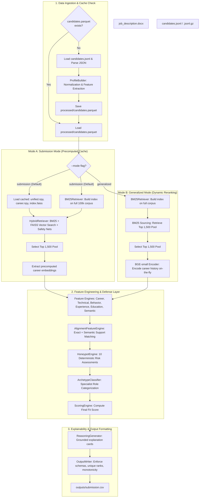

# Technical Architecture One-Pager: Intelligent Candidate Discovery

This document details the architectural blueprint, data flows, and algorithmic complexity of the Redrob Candidate Discovery and Ranking System (v3.0).

---

## 1. Architectural Blueprint & Data Flow

The system employs a **Dual-Mode Ingestion and Retrieval Architecture** built specifically to resolve the tension between static benchmark optimization and dynamic out-of-sample evaluation under a 5-minute CPU runtime budget.

---

## 2. Ingestion & Retrieval Layer Details

### Mode A: Submission Mode (FAISS Cached)
Designed for the official submission run. It uses pre-computed candidate embeddings and a serialized FAISS index to perform high-speed vector retrieval across the entire 100,000-candidate database.
*   **Retrieval Mechanism:** Hybrid logic. Matches the query using BM25 and searches the FAISS index with inner-product cosine similarity. Merges scores using a weighted combination ($0.4 \times \text{BM25} + 0.6 \times \text{FAISS}$).
*   **Safety Nets:** Candidate profiles containing explicit target titles (e.g. `ml engineer`, `data scientist`) or specialized niche skills (e.g. `learning to rank`, `bm25`) are automatically appended to the retrieval pool to prevent recall loss on high-value matches.
*   **Performance:** In our benchmark environment we observed approximately 30 seconds pipeline runtime and ~4.5 GB peak RAM.

### Mode B: Generalized Mode (Dynamic Reranking)
Designed to run on unseen databases. Bypasses precomputed index structures.
*   **Retrieval Mechanism:** Builds a fast BM25 index on the raw candidate records. Slices the top 1,500 candidates based on keyword matching.
*   **Dynamic Encoding:** Instantiates the local `bge-small-en-v1.5` transformer model to generate career embeddings on-the-fly *only* for the retrieved 1,500 candidate pool. Bypasses the quadratic scaling cost ($O(N)$) of encoding all 100,000 profiles.
*   **Optimizations:** Career descriptions are truncated to 1,000 characters to cap transformer self-attention calculations ($O(L^2)$). Query similarities are mapped directly to career embeddings, avoiding redundant inference passes.
*   **Performance:** In our benchmark environment we observed under 60 seconds pipeline runtime and ~5.8 GB peak RAM.

---

## 3. Scoring & Validation Mathematics

The scoring engine operates on a deterministic, weighted linear model to mitigate black-box opacity and support explainability and predictability. The total score $S$ for a candidate is computed as:

$$S = \text{clip}\left(\sum_{i} W_i \times F_i - \text{Honeypot Penalty}, \; 0.0, \; 1.0\right)$$

### Scoring Feature Weights ($W_i$)
1.  **Career Match ($F_{\text{career}}$, 30%):** Evaluates role relevance over time, progression tier, and sector alignment.
2.  **Technical Fit ($F_{\text{tech}}$, 26%):** Calculated dynamically using concepts extracted from the JD (ML, Retrieval, Ranking, Recommendation, LLMs).
3.  **Skill-Career Alignment ($F_{\text{align}}$, 16%):** Checks if the candidate's claimed technical skills are validated by written career descriptions.
4.  **Recruitability ($F_{\text{rec}}$, 12%):** Aggregates response rates, recruiter saves, and interview completion scores.
5.  **Semantic Similarity ($F_{\text{semantic}}$, 8%):** Cosine similarity between the JD text and candidate profiles.
6.  **Experience Fit ($F_{\text{exp}}$, 5%):** Maps total years of experience against a JD preference curve (optimum target: 5–9 years).
7.  **Specialist Archetype ($F_{\text{archetype}}$, 2%):** Heuristic boost for matching specific archetypes (e.g. Retrieval Specialists).
8.  **Education Fit ($F_{\text{edu}}$, 1%):** Assesses university prestige tiering and degree alignment.

### Honeypot Penalties
A suite of 10 deterministic checks evaluates profile contradictions (e.g., account signup date occurring after the last active date, high tech claims with zero career history, high assessments on unlisted skills). Active flags deduct scores (up to a capped penalty of `-0.45`).

---

## 4. Run-Time Complexity and Benchmarks

### Big-O Complexity Analysis

| Pipeline Stage | Algorithmic Complexity | Bottleneck Factor | Mitigation Strategy |
| :--- | :--- | :--- | :--- |
| **Ingestion** | $O(N)$ | Disk I/O & JSON parsing | Parquet caching saves raw parsing time on warm runs. |
| **BM25 Build** | $O(N \cdot L_t)$ | Text tokenization ($100k$ candidates) | Fast regex-based tokenization; limits vocabulary size. |
| **Dense Search** | $O(N \cdot D)$ (Mode A) | Matrix multiplication in FAISS | Cached inner-product flat FAISS index; runs in a small fraction of total runtime. |
| **Dynamic Encoding** | $O(M \cdot L_c^2 \cdot D)$ (Mode B) | CPU Transformer self-attention | Prunes pool to $M=1500$ first; truncates text length $L_c \le 1000$. |
| **Scoring** | $O(M)$ | Feature calculations | Vectorized NumPy operations; avoids iterative loops. |
| **Reasoning** | $O(K)$ | String formatting ($K=100$ output) | Restricts text generation to top 100 candidates only. |

